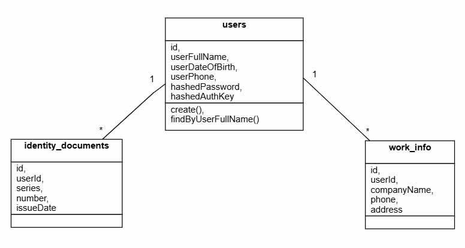

Тестовое задание.

Проект разделен на две части - серверная (директория server) и клиенская (директория page).

Запуск проекта:

1.  В директории server выполнить команды:

-   npm install
-   npm run start

2.  В директории page выполнить команды:

-   npm install
-   npm run dev
-   o

В результате будет запущен сервер, создана база данных и в окне браузера откроется страница с формами регистрации и
авторизации.  
При регистрации нового пользователя в терминале сервера отобразятся входящие данные.  

